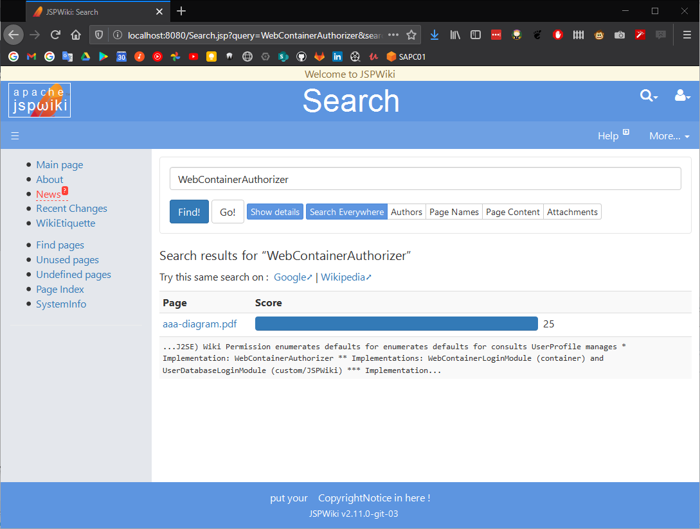

# JSPWiki Kendra Search provider

## What is AWS Kendra

    Amazon Kendra is an intelligent search service powered by machine learning. 

## How to use Kendra with JSPWiki

1. AWS Account

You will need an AWS Account if you have not one already: [create-account](https://aws.amazon.com/resources/create-account/)

2. Create the Kendra Index and DataSource

In you can use the [index-and-datasource](cloudformation/index-and-datasource.yaml) Cloudformation stack to create the Kendra Index and DataSource.
This require that you have either the [AWS Cli](https://docs.aws.amazon.com/cli/latest/userguide/install-cliv2.html) or the [SAM Cli](https://docs.aws.amazon.com/serverless-application-model/latest/developerguide/serverless-sam-cli-install.html) installed.
Once installed you can simply run the following command to create your Kendra Index and DataSource:

```shell
sam build --template cloudformation/index-and-datasource.yaml
sam deploy --guided
```

*Note*: it is important that the name for your Index and DataSource match the names setup in your JSPWiki Installation.
Namely make sure the properties `jspwiki.kendra.indexName` and `jspwiki.kendra.dataSourceName` are properly configured.

4. Testing in Docker

You can test your search index by running docker (*Note* you'll be using your AWS credentials)

```shell
mvn package -pl jspwiki-war,jspwiki-wikipages/en -am -DskipTests
docker build -t jspwiki-kendra-searchprovider:latest -f jspwiki-kendra-searchprovider/Dockerfile .
docker run -p 8080:8080 -v ~/.aws:/root/.aws jspwiki-kendra-searchprovider:latest
```

Then you can create a Page, upload some PDF, and search for some content in the PDF document



